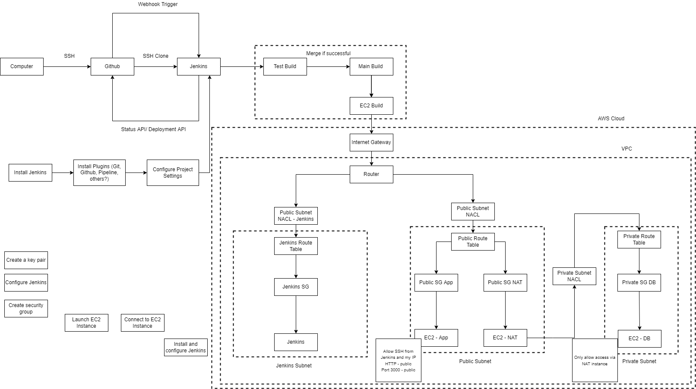

## Install Java onto the Jenkins EC2 instance server
- https://www.digitalocean.com/community/tutorials/how-to-install-java-with-apt-on-ubuntu-18-04#installing-specific-versions-of-openjdk
- Ubuntu 18.04 includes Open JDK 11, which is an open-source variant of the JRE and JDK.
- To install this version, first update the package index:
- `sudo apt update`
- check if Java is already installed:
- `java -version`
- If Java is not currently installed
- `sudo apt install default-jre`
- verify
- `java -version`
- install jdk
- `sudo apt install default-jdk`
- verify
- `javac -version`
## Install Jenkins onto the Jenkins EC2 instance server
- https://www.digitalocean.com/community/tutorials/how-to-install-jenkins-on-ubuntu-18-04
- Jenkins should now be working on the EC2 instance
- Get repository
- `wget -q -O - https://pkg.jenkins.io/debian-stable/jenkins.io.key | sudo apt-key add -`
- Append the Debian package repository address to the server’s sources.list:
- `sudo sh -c 'echo deb http://pkg.jenkins.io/debian-stable binary/ > /etc/apt/sources.list.d/jenkins.list'`
- Update and install
- `sudo apt update`
- `sudo apt install jenkins`
- Start Jenkins
- `sudo systemctl start jenkins`
- verify status
- `sudo systemctl status jenkins`
- Opening firewall, open port 8080
- `sudo ufw allow 8080`
- Confirm status
- `sudo ufw status`
- if firewall inactive
```
sudo ufw allow OpenSSH
sudo ufw enable
```
- Go to http://your_server_ip_or_domain:8080
- get admin password, copy and paste into website
- `sudo cat /var/lib/jenkins/secrets/initialAdminPassword`
- Install suggested plugins
- Enter user details etc.
- Should be set up
- Install 'ssh', 'ssh-agent' and 'nodejs'


## Notes
- If articles no longer exist, see 'Useful Articles' folder for downloaded copy
## The execution shell script in Jenkins for the app instance

```
rsync -avz -e "ssh -o StrictHostKeyChecking=no" app ubuntu@54.246.30.224:/home/ubuntu


ssh -A -o "StrictHostKeyChecking=no" ubuntu@54.246.30.224 <<EOF

# install git
#sudo apt-get install git -y
#rm -rf Shahrukh_eng99_CICD/

#git clone https://github.com/jo763/Shahrukh_eng99_CICD
# Change permission of provision to executable and then executing it
chmod +x /home/ubuntu/Shahrukh_eng99_CICD/environment/app/provision.sh
/home/ubuntu/Shahrukh_eng99_CICD/environment/app/provision.sh
cd /home/ubuntu/Shahrukh_eng99_CICD/app
sudo apt install npm -y
sudo npm install -y
echo 'export DB_HOST="mongodb://10.0.7.66:27017/posts"' >> .bashrc
#npm start
EOF
```


## The execution shell script in Jenkins for the database

```
rsync -avz -e "ssh -o StrictHostKeyChecking=no" environment/ ubuntu@10.0.7.66:/home/ubuntu

ssh -A -o "StrictHostKeyChecking=no" ubuntu@10.0.7.66 <<EOF


# Change permission of provision to executable and then executing it
chmod +x /home/ubuntu/environment/db/provision.sh
/home/ubuntu/environment/db/provision.sh
##cd /home/ubuntu/Shahrukh_eng99_CICD/app
##sudo apt install npm -y
##sudo npm install -y
#npm start
# Allow members of group sudo to execute any command
EOF
```
